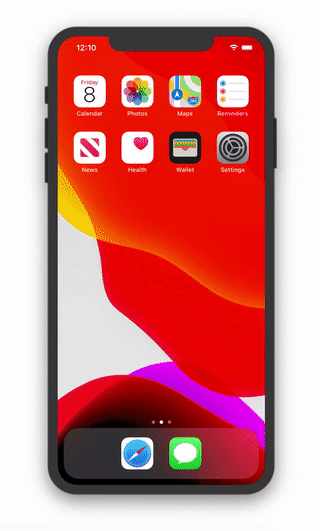
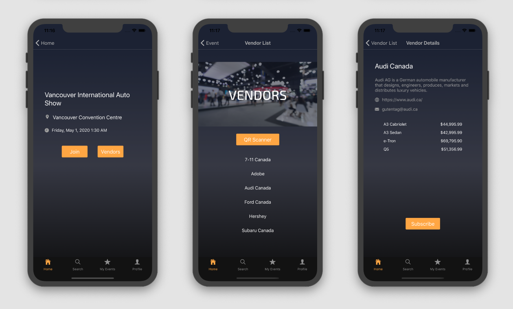

# Industry - SSD
A React Native and .NET Marketing Application created by Athena, Tony, Albert, Crystal, Kasra. Copyright 2020.

View live demo on your phone by scanning the QR code: [https://expo.io/@kasra-n/atack-marketing](https://expo.io/@kasra-n/atack-marketing)


  
## Features
User Profile:
- Register
- Login

QR Scanner:
- Implements camera to scan vendor QR codes and subscribe

Search / View Event:
- Search for events
- Users can join and leave events
- View vendors
- Manually subscribe to vendors
- Information displayed in a detailed view

## Technologies
- React Native
- .NET
- Adobe XD

## Application Prototype
[View the full prototype on Adobe XD](https://xd.adobe.com/view/af850f75-0f9d-414c-6f33-cc7305f76382-d9b4/)

## Mobile App




## What's Next?
- Vendor logo images
- List views with sorting feature
- Pull to refresh
- Unsubscribe from subscription list

## Available Scripts - Installation

If Yarn was installed when the project was initialized, then dependencies will have been installed via Yarn, and you should probably use it to run these commands as well. Unlike dependency installation, command running syntax is identical for Yarn and NPM at the time of this writing.

### `npm start`

Runs your app in development mode.

Open it in the [Expo app](https://expo.io) on your phone to view it. It will reload if you save edits to your files, and you will see build errors and logs in the terminal.

Sometimes you may need to reset or clear the React Native packager's cache. To do so, you can pass the `--reset-cache` flag to the start script:

```
npm start -- --reset-cache
# or
yarn start -- --reset-cache
```

#### `npm test`

Runs the [jest](https://github.com/facebook/jest) test runner on your tests.

#### `npm run ios`

Like `npm start`, but also attempts to open your app in the iOS Simulator if you're on a Mac and have it installed.

#### `npm run android`

Like `npm start`, but also attempts to open your app on a connected Android device or emulator. Requires an installation of Android build tools (see [React Native docs](https://facebook.github.io/react-native/docs/getting-started.html) for detailed setup). We also recommend installing Genymotion as your Android emulator. Once you've finished setting up the native build environment, there are two options for making the right copy of `adb` available to Create React Native App.
